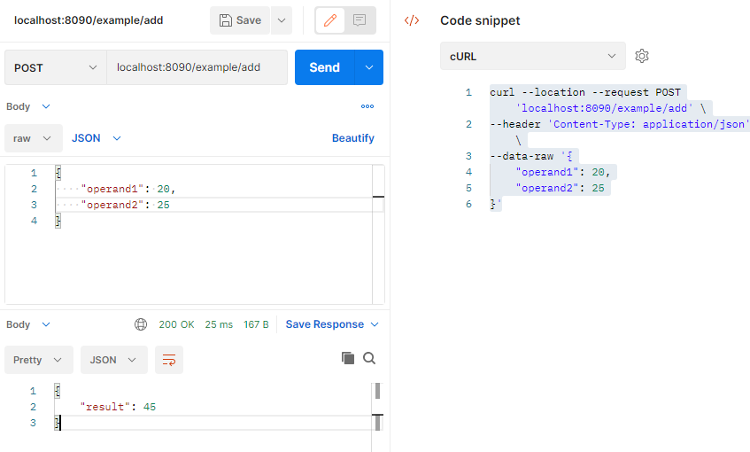

# grpc-calculator

Basic Calculator using gRPC architecture in Golang.

# Setup

> Generate protobuffers using protoc

`$ protoc -I .\proto --go_out .\proto --go_opt paths=source_relative --go-grpc_out .\proto --go-grpc_opt paths=source_relative --grpc-gateway_out .\proto --grpc-gateway_opt paths=source_relative .\ --openapiv2_out .\proto proto\calculator\calculator.proto `

> Generate protobuffers using buf

### Buf installation

- Download buf binaries from [buf release for windows](https://github.com/bufbuild/buf/releases)
- Move binaries to your GOBIN directory.

### Configure dependencies

`$ buf-Windows-x84_64.exe mod update`

### Download dependencies

`$ buf-Windows-x84_64.exe build`

### Generate Stubs

`$ buf-Windows-x84_64.exe generate --path .\proto\calculator\calculator.proto`

# Running

> To start gRPC/gRPC-Gateway server run:

`$ go run .\calculator_server\main.go`

To test gRPC server (add/subtract/multiply/divide) endpoints run:

#### _ADD_

`$ go run .\calculator_client\main.go` 20 22 +

#### _SUBTRACT_

`$ go run .\calculator_client\main.go` 62 20 -

#### _MULTIPLY_

`$ go run .\calculator_client\main.go` 7 6 \*

#### _DIVIDE_

`$ go run .\calculator_client\main.go` 420 10 /

To test gRPC-Gateware HTTP server (add/subtract/multiply/divide) endpoints run:

`$ curl --location --request POST 'localhost:8090/example/add' --header 'Content-Type: application/json' --data-raw '{ "operand1": 20, "operand2": 25 }' `

For the HTTP server, it is recommended to test from POSTMAN or any other API testing service.

# Openapiv2 Swagger

Use the following link to see the Swagger API documentation. [Swagger Api Documentation](https://app.swaggerhub.com/apis/valberto-enoc/calculator-calculator_proto/1.0)
